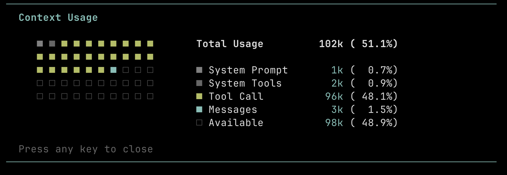

# Pi Context Extension

A Git-like context management tool that allows AI agents to proactively manage their context.

Inspired by kimi-cli d-mail, implementing lossless time travel on the Pi session tree.

## Installation

```bash
pi install npm:pi-context
```

## Usage

### For Humans

Load the skill to enable the workflow:

```bash
/skill:context-management
```

View detailed context window usage and token distribution with a visual dashboard. (like `claude code /context`)

```bash
/context
```



### For Agents

This extension adds the `context-management` skill with three core tools:

1.  **🔖 Structure (`context_tag`)**
`git tag` Create named milestones to structure your conversation history.

2.  **📊 Monitor (`context_log`)**
`git log` Visualize your conversation history, check token usage, and see where you are in the task tree.

3.  **⏪ Compress (`context_checkout`)**
`git checkout` Move the HEAD pointer to any tag or commit ID. Compress completed tasks into a summary to free up context window space.
